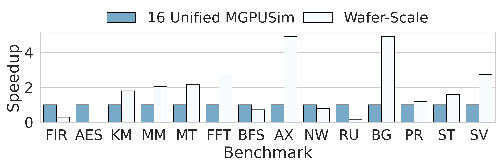

# akitaplot

Akita plot is an easy-to-use performance plot drawing tool for [Akita project](https://gitlab.com/akita), especially for [MGPUSim simulator](https://gitlab.com/akita/mgpusim).

Some features of Akita plot:
- Compare and visualize the performance of different configurations (i.e. models) running the same set of benchmarks
- Generate the **analyzing tables** and draw the **paper-writing-friendly** plot with fancy style
- Flexible and self-adaptive to render multiple models without too much efforts
- Full support for user to decorate and customize the plot

## Usage

### Config Mode

In general, we use YAML configuration and a Python snippet to process the config. Here are some detailed steps:

1. Copy the example of `config.yaml` to your work directory in which the script outputs the analyzing results, e.g. intermediate tables and final plots.

2. Customize YAML file, e.g. add the benchmarks details, set the metric type we're interested in, and set the program path of baseline and optimized models.

3. Determine the kind of the data analyzing, **speedup comparing** or **general data analyzing**.

   - For **speedup comparing**: we've implemented a partially-complete class as example in `akitaplot.py`, so just override some methods e.g. `speedup_plot_base.decorate()` in a new script to meet your demands.
   - For **general data analyzing**: just follow the example of class `speedup_table_base`, `speedup_plot_base`, `speedup_base`, extend only three superclass `table`, `plot`, `workflow` and implement those interfaces.

4. Import the `akitaplot.py` as a module, then use the least codes to generate your amazing plots!

### Coding Mode

Instead of using YAML file, coding the configuration in Python provides more flexibility.

1. Write a script like `speedup.py`, using tuple to store the configuration of benchmarks.

   - for an existed CSV, use `("FIR", metrics("/path/to/fir.csv"))`.
   - to run the benchmark in the meantime, use `("FIR", runner("/path/to/fir", "-timing -verify"))`.

2. Run the script to get the fancy plot!

## Examples

### Config Mode

- For **speedup** example, we provided `config_speedup.py`. 
- While for **general data analyzing**, we provided `example.py` including three `visual` prefix classes with the similar purpose to `speedup_table_base`, `speedup_plot_base`, `speedup_base` in `akitaplot.py`.

After customizing the YAML, we could run the script to get all `<grab item>.pdf` and `<grab item>.png` in the work directory, and the interactive Matplotlib GUI to zoom the plot. (The _grab items_ are defined in YAML, stand for the metric types you would like to select.)

### Coding Mode

We provided an archive of example metrics in `example_data.tar.gz` collected by [Akita actions](https://github.com/ueqri/actions) in real test. Unzip the tarball and run the `speedup.py`, you will get the following plot without extra efforts:

## Forthcoming

- [ ] Provide easy-to-use interface for [Akita actions](https://github.com/ueqri/actions) to build a pipeline, which could run benchmarks in distributed system, collect the results file and generate the plot!
